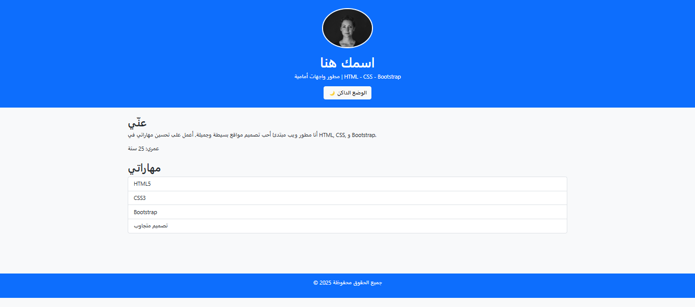
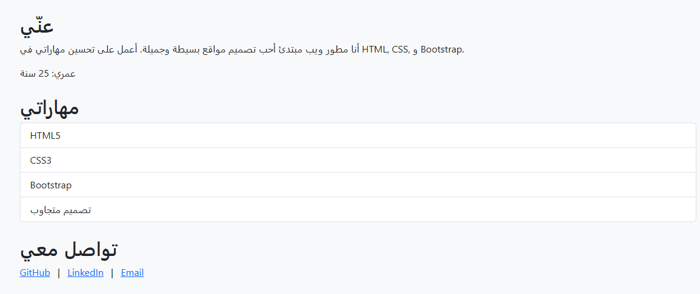

# 🌟 بروفايلي الشخصي (Personal Portfolio)

---

## 📌 وصف المشروع
مشروع بروفايل شخصي بسيط ومتجاوب يوضح نبذة عني، مهاراتي، وروابط التواصل،  
مع إضافات **JavaScript** للتفاعل مثل:
- 🌙 الوضع الداكن / ☀️ الفاتح
- ⏳ حساب العمر تلقائيًا
- 🎨 أنيميشن عند التمرير

---

## 🛠 الأدوات المستخدمة
- **HTML5** — هيكل الصفحات
- **CSS3** — تنسيقات وتصميم الموقع
- **Bootstrap 5** — تصميم متجاوب جاهز وسريع
- **JavaScript (Vanilla)** — إضافة تفاعلية للموقع
- **Git & GitHub** — لإدارة الإصدارات ورفع المشروع

---

## ✨ المميزات
- 📱 تصميم متجاوب يعمل على جميع الأجهزة
- 🌙☀️ وضع داكن وفاتح
- ⏳ حساب العمر تلقائيًا
- 🎨 أنيميشن عند التمرير
- 📂 كود منظم وسهل التطوير

---

## 📷 لقطات من المشروع

### 🖥 الصفحة الرئيسية

### 🌙 وضع الداكن

### 📄 قسم "عني"

---

## 🚀 تجربة المشروع
📍 **رابط المشروع المباشر:** [اضغط هنا لفتح الموقع](https://MajekAhmed.github.io/personal-portfolio)

---

## 📞 للتواصل
أنا متاح لتصميم صفحة بروفايل مشابهة مقابل **5 دولار** وأعمل كـ **فريلانسر**.

📧 **Email:** owen.ar2002"gmail.com 

💼 **LinkedIn:** [linkedin.com/in/ahmed-ragab-mohmed](https://www.linkedin.com/in/ahmed-ragab-mohmed/) 
💻 **GitHub:** [github.com/MajekAhmed](https://github.com/MajekAhmed)

---
> 💡 لا تتردد بالتواصل إذا أردت تطوير مشروعك أو الحصول على نسخة خاصة بك من الموقع.

